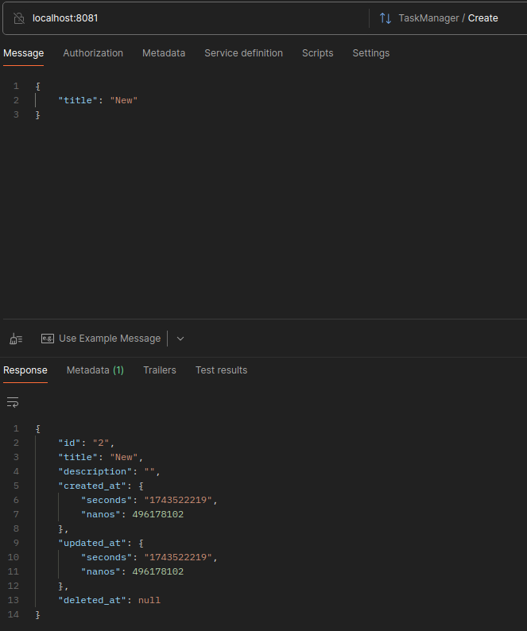
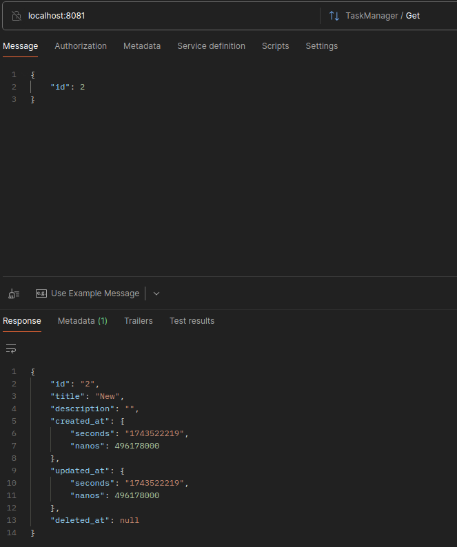
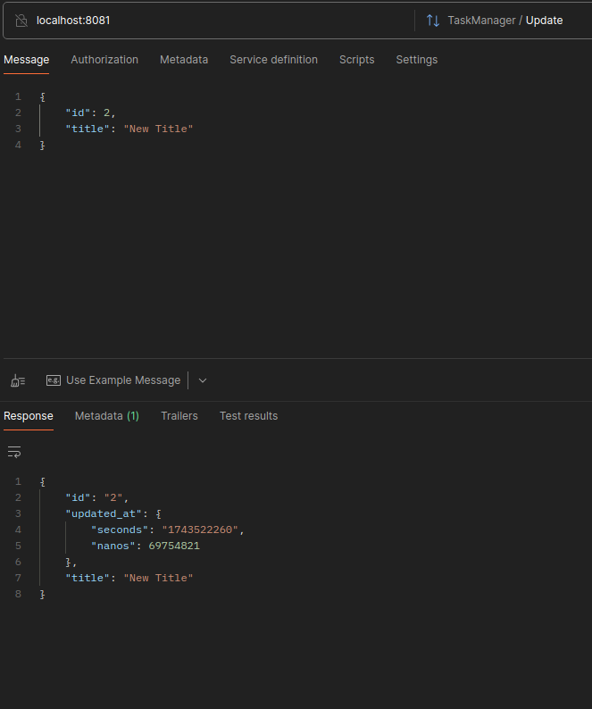
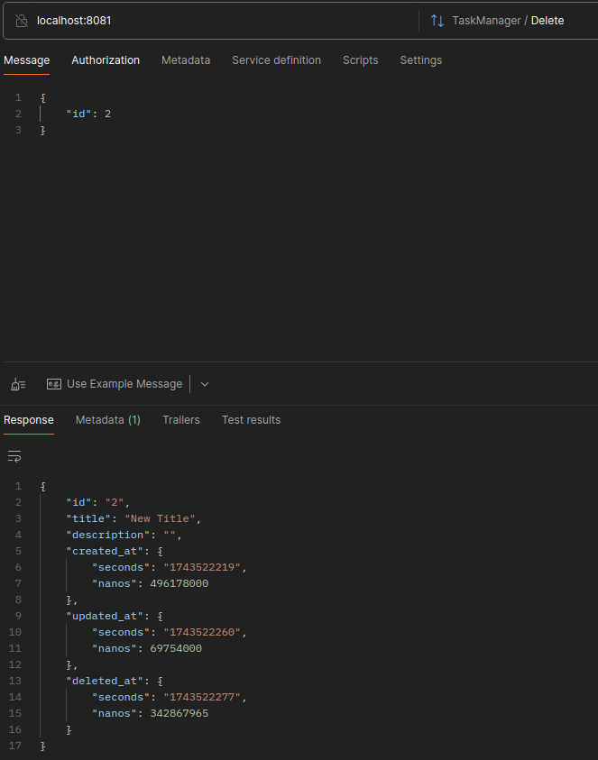
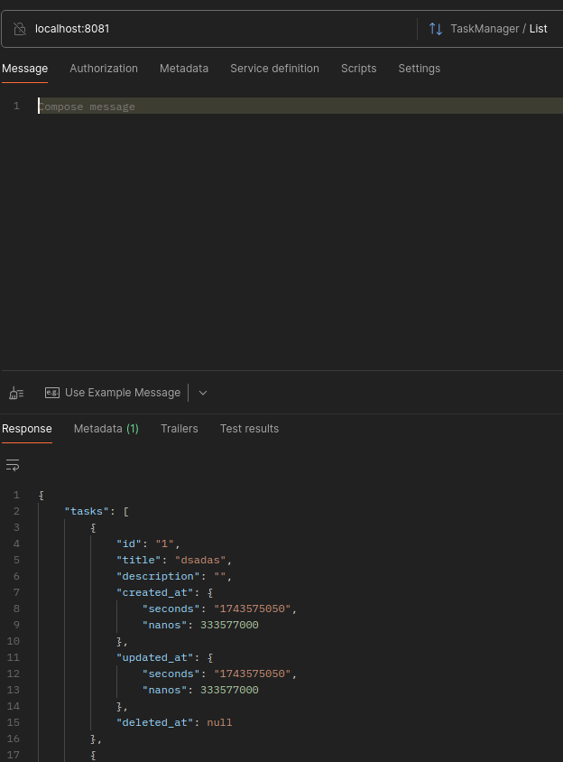

# Task Manager

Простая система управления задачами, созданная с использованием **Go**, **Gorm**, **GRPC**, **PostgreSQL** и **Docker**. Это приложение позволяет пользователям выполнять базовые CRUD-операции (создание, чтение, обновление, удаление) над задачами.

## Используемые технологии

- **Go**
- **Gorm**
- **GRPC**
- **PostgreSQL**
- **Docker**

## Модель Task (Gorm)

Модель Task содержит следующие поля:

- **ID**: Уникальный идентификатор задачи.
- **Created At**: Временная метка создания задачи.
- **Updated At**: Временная метка последнего обновления задачи.
- **Deleted At**: Временная метка удаления задачи (мягкое удаление).
- **Title**: Заголовок задачи.
- **Description**: Подробное описание задачи.

```go
type Task struct {
    ID          uint      `gorm:"primaryKey"`
    CreatedAt   time.Time
    UpdatedAt   time.Time
    DeletedAt DeletedAt `gorm:"index"`
    Title       string    `gorm:"size:64"`
    Description string    `gorm:"size:512"`
}
```

## Функциональность

### 1. Каждый метод возвращает только необходимые данные  
Например, при обновлении возвращаются только обновлённые поля и `updated_at`.

### 2. Валидация на уровне структуры данных  
Каждый метод пытается поместить все входящие поля в структуру через сеттеры. Если какое-то поле не подходит, будет возвращена ошибка, и операция будет отменена.

### 3. Разделение слоёв приложения  
Существует структура Task, которая отвечает за работу с базой данных. Она содержит методы для преобразования (и валидации) данных, поступающих из GRPC, в формат `gorm.Model`.

### 4. Модификация Protobuf  
Если вы хотите изменить GRPC-сообщения, отредактируйте файл `src/proto/task_manager.proto` и выполните в корневой директории:
```bash
make generate
```
Для генерации необходимых файлов.

## GRPC методы сервиса

### 1. **Create**  
Создаёт новую задачу.

#### Объект запроса:
```protobuf
message CreateTaskRequest {
    string title = 1;
    optional string description = 2;
}
```

#### Объект ответа:
```protobuf
message GetTaskResponse {
    uint64 id = 1;
    string title = 2;
    string description = 3;
    google.protobuf.Timestamp created_at = 4;
    google.protobuf.Timestamp updated_at = 5;
    google.protobuf.Timestamp deleted_at = 6;
}
```



---

### 2. **Get**  
Получает задачу по ID.

#### Объект запроса:
```protobuf
message IdRequest {
    uint64 id = 1;
}
```

#### Объект ответа:
```protobuf
message GetTaskResponse {
    uint64 id = 1;
    string title = 2;
    string description = 3;
    google.protobuf.Timestamp created_at = 4;
    google.protobuf.Timestamp updated_at = 5;
    google.protobuf.Timestamp deleted_at = 6;
}
```



---

### 3. **Update**  
Обновляет существующую задачу.

#### Объект запроса:
```protobuf
message UpdateTaskRequest {
    uint64 id = 1;
    optional string title = 2;
    optional string description = 3;
}
```

#### Объект ответа:
```protobuf
message UpdateTaskResponse {
    uint64 id = 1;
    optional string title = 2;
    optional string description = 3;
    google.protobuf.Timestamp updated_at = 4;
}
```



---

### 4. **Delete**  
Удаляет задачу по ID (мягкое удаление).

#### Объект запроса:
```protobuf
message IdRequest {
    uint64 id = 1;
}
```

#### Объект ответа:
```protobuf
message GetTaskResponse {
    uint64 id = 1;
    string title = 2;
    string description = 3;
    google.protobuf.Timestamp created_at = 4;
    google.protobuf.Timestamp updated_at = 5;
    google.protobuf.Timestamp deleted_at = 6;
}
```



---

### 5. **List**  
Получает список всех задач.

#### Объект запроса:
```
Empty
```

#### Объект ответа:
```protobuf
message ListTasksResponse {
    repeated GetTaskResponse tasks = 1;
}
```



---

## Инструкция по запуску

### 1. Клонировать репозиторий
```bash
git clone https://github.com/alibekubaidullayev/task-manager.git
cd task-manager
```

### 3. Сборка и запуск с Docker  
Для запуска приложения в Docker-контейнере выполните:

```bash
docker-compose up --build
```

Это создаст необходимые таблицы в PostgreSQL с использованием Gorm.

### 3. Приложение  
Доступно по порту 8081 на локальном устройстве.